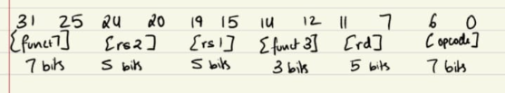
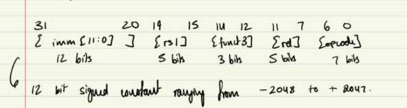
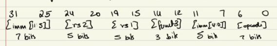
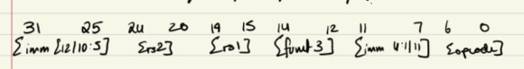
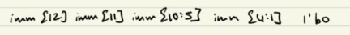
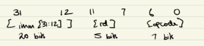
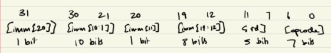

# Phase 2: Personal Notes for my RV32I learning journey.

## DAY 15: Introduction to ISA and Registers

### What is an ISA?
- An ISA (Instruction Set Architecture) is like a contract between the software and the hardware it tells what instructions exist and what they do , how many registers exist and how wide each of them are , how the memory is addressed and also how the data is represented. RISC-V for example is a open source ISA other examples are ARM and x86.

### What is RV32I?
- RV - RISC V
- 32 - 32 bit registers and address space
- I - base integer instruction set

### Why are you using RISC-V?
- Eventhough other ISA's exist RISC-V is the only open source one and is being heavily researched and expanded at the time by startups, people, companies, countries like India and China are heavily investing in it as it has no licensing fee required and ordinary learners like myself can use it to learn and develop.

### RISC vs CISC?
- They both are built on opposite philosophies RISC means the instructions are simple and standard allowing the hardware to be more simple in turn the compiler has a bit more work to do and for more complex tasks the instructions are to be compounded.
- In CISC the instructions tend to be complex as in multiple cycles and harder tasks making the compilers job easier in turn the hardware becomes a lot more complex as you need special circuitry to support such instructions.

### What are your 32 registers? (Using actual register/ABI)
- x0/zero : holds the value zero at all times cannot be written to and is helpful is many tasks inculding transferring values between registers.
- x1/ra : return address is held over here so we can jump back after a function call.
- x2/sp : tracks the top of the stack helping it grow and shrink.
- x3/gp : global pointer , points to the middle of the region of memory that hold global variables.
- x4/tp : thread pointer yet to fully understand what this does.
- t0-t6 (x5-x7 --> t0-t2 and x28-x31 --> t3-t6): these are temporaries they are registers that act as scratchpads as in functions can change and manipulate values within them to their liking.
- s0-s11 (x8-x9 --> s0-s1 and x18-x27 --> s2-s11): these are saved registers here the values can be chnaged within the function but before returing the intial value at function call must be restored within these registers.
- a0-a7 (x10-x17 --> a0-a7): these are argument registers they are used for passing function arguments and also the return value returns through a0.

### What do you know about the stack till now?
- The stack is a region of the memory that grows and shrinks while your program runs. Whenever you call a function it requires temporary space for it's local variables. That space is given by the stack and the when the function ends that space is then given back.

## DAY 16: Instruction Formats

### What are the 6 Formats and why are they needed?
- The six formats are R , I , S , B , U , J. They are needed because there are many types of instructions in the RISC-V ISA and all of them have different needs and thus to make sure that every instruction is 32 bits long all their needs are attended to and the hardware is as simple as possible we have these 6 types of instruction formats.

### R-type instructions (Register to Register)
- These are register to register instructions. So here we need two source registers to do something and we return the result to a destination register.
- Here is an image to show how the bits are allocated:
- 
- opcode tells which family of instruction it is like r-type then funct3 is used to narrow it down to groups within the family and funct7 here does the final narrowing down usually do not need it but in cases like ADD and SUB the SUB has 30th bit as 1 rather than 0 like in ADD thus funct7 plays a role.

### I-type instructions (Immediate operations)
- Rather than two source registers ,this has one register and a constant baked into it directly. The constant is called an immediate.
- Here is an image to show how the bits are allocated:
- 
- The 12 bit immediate is extended to 32 bits using sign extension.
- This does not require funct7 as the opcode and funct3 are enough for distinguishing here.

### S-type instructions (Store instructions)
- It is used for storing data to memory. It basically takes a value sitting in a register and writes it to a memory address (base register + offset).
- Here is an image to show how the bits are allocated:
- 
- The immediate is split as RISC-V is designed in such a way that rs1 and rs2 bit positions should remain the same in all formats this allows the CPU to decode and perform register reading at the same time making it a lot more efficient.

### B-type instructions (Branch instructions)
- These are used for conditional branches --> if some part of the code is correct jump to a different part of the program.
- Here is an image to show how the bits are allocated:
- 
- Unlike S the splitting bits are reordered.
- So upon reassembly the offset would look like:
- 
- Cause of how RISC-V works the target address will always be at a even postion thus we always have a zero at the end giving us a 13 bit offset and more range. Thus to keep S and B as similar as possible and to try and keep the hardware as reused they had to reorder the bits.

### U-type instructions (Upper Immediate)
- The simplest instruction format basically takes a 20 bit immediate and a destination register and just copies the immediate to the top 20 bits of the rd and the rest are zeroes mostly used to copy immediates to registers this instruction gives 20 bits and the rest are from I type.
- Here is an image to show how the bits are allocated:
- 
- Only two instructions use this format and those being LUI and AUIPC.

### J-type instructions (Jump instruction)
- Only one instruction uses this JAL (jump and link). All it does it jumps to the new address (PC + offset) and then saves the return address into rd (PC +4).
- Here is an image to show how the bits are allocated:
- 
- Has a 21 bit offset reassembled allowing the jump range to be +- 1 MB.

### Key things that connect all the types
- The opcode is always at [6:0], the rs1 is always at [19:15] and the rs2 is always at [24:20].

## DAY 17: R-type Instructions

### What are R-type instructions?
- R-type instructions are register to register , there are a total of 10 of them in RV32I, they include:
- ADD: adds two registers
- SUB: subtracts rs2 from rs1
- AND: bitwise AND of two registers
- OR: bitwise OR of two registers
- XOR: bitwise XOR of two registers
- SLL: shifts rs1 left by rs2 amount, fills with zeros. Works the same for signed and unsigned.
- SRL: shifts rs1 right by rs2 amount, fills with zeros. It is intended for unsigned numbers.
- SRA: shifts rs1 right by rs2 amount, fills with sign bit. It preserves sign so it is intended for signed numbers.
- SLT: rd = 1 if rs1 < rs2 (signed), else 0
- SLTU: rd = 1 if rs1 < rs2 (unsigned), else 0
- Since they are all of the same type of instructions they all have the same opcode `0110011` the only thing that changes is the funct3 and funct7 and this helps in distinguishing between them.

### How exactly do funct3 and funct7 work?
- funct3 basically helps in identifying most of the instructions by grouping them into families but funct7 is needed for 2 pairs of the instructions including ADD/SUB and SRL/SRA. These pairs have the same opcode and funct3 only funct7 differs, for ADD/SRL the 30th bit is 0 while for SUB/SRA it is 1.
- Every other instruction has a unique funct3 and funct7 for them is all zeroes.

### What did you build?
- To show what I learnt I built a 32-bit RV32I ALU which handles all 10 R-type instructions using Verilog.
- Made the right use of `$signed()` for SLT and SRA do get the right signed behaviour.
- Made the use of a zero output flag as well when the result of the ALU is zero.

## DAY 18 : I-type Instructions

### What are I-type instructions?
- These are called immediate instructions they work exactly like the R-type instructions the only difference being the fact that rather than using 2 registers they make use of one register and one immediate value.
- ADDI: adds an immediate to a register value
- ANDI: bitwise AND of a register and an immediate
- ORI: bitwise OR of a register and an immediate
- XORI: bitwise XOR of a register and an immediate
- SLLI: shifts rs1 left by immediate amount, fills with zeros. Works the same for signed and unsigned.
- SRLI: shifts rs1 right by immediate amount, fills with zeros. It is intended for unsigned numbers.
- SRAI: shifts rs1 right by immediate amount, fills with sign bit. It preserves sign so it is intended for signed numbers.
- SLTI: rd = 1 if rs1 < immediate (signed), else 0
- SLTIU: rd = 1 if rs1 < immediate (unsigned), else 0 (remember the immediate here is still **sign extended** first and then used for comparison)
- They all share the same opcode which is `0010011` the immediate in all these cases is a 12 bit value which is sign extended to 32 bits when it is used in the operation. But there are expceptions that I will be getting to soon. Another thing is that there is no funct7 for these instructions and no rs2 as we are using the immediate.
- Also there is no such thing as SUBI as you can use ADDI with a negative imemdiate for subtraction thus RISC-V intentionally doesn't implement it as its not needed.

### Difference for I-type shifts
- I-type shifts are different see the thing is for shifting you only need 5 bits as thats the max shift you can do for a 32 bit value after that it is always all zeroes. Thus, the immediate for shift is divided with the upper 7 bits being `0000000` for the SLLI and SRLI and `0100000` for the SRAI , the one for SRAI is needed as it shares the funct3 and opcode with SRLI so this is the only point of distinguishing between SRAI and SRLI and the lower 5 bits for the immediate is for the actual shift operation. Thus, this is also why sign extension does not apply for the shift instructions as the top 7 bits are needed for something else and the lower 5 is the only ones we are working with so there is no 12 or 32 bit sign extension.

### What is masking?
- The ANDI , XORI and the ORI can be used for masking meaning manipulating your register values to your liking so in the case for ANDI using of zeroes removes those bits and only the bits with 1 will allow the value to pass through , for ORI using 1 forces the bits to 1 and using 0 allows the original bits to pass through , lastly XORI using 1 causes the bits to switch while 0 allows them to pass through this is how you can use these bitwise operations to your advantage.

### Hand Encoding Practice

**1. `ADDI x1, x0, -1`**
- imm = -1 --> `111111111111`
- rs1 = x0 --> `00000`
- funct3 = ADDI --> `000`
- rd = x1 --> `00001`
- opcode = `0010011`
- Full: `1111 1111 1111 0000 0000 0000 1001 0011`
- Hex: `0xFFF00093`

** USING THESE STEPS I SOLVED THE FOLLOWING: **

**2. `ANDI x4, x4, 255` --> `0x0FF27213`**

**3. `SLTI x6, x2, 100` --> `0x06412313`**

**4. `SLLI x7, x1, 3` --> `0x00309393`**

**5. `SRAI x8, x7, 2` --> `0x4023D413`**